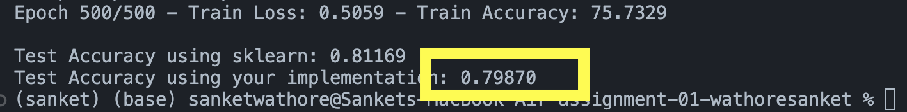

# Logistic-Regression-From-Scratch
 This repository hosts Python code for implementing logistic regression from scratch. The code is applied to the Pima Indians Diabetes Database for accurately predicting diabetes based on medical attributes.

## Dataset Description

The Pima Indians Diabetes Database is a widely used dataset in machine learning, particularly for binary classification tasks related to diabetes prediction. The dataset consists of 768 instances with 8 numeric predictive attributes and a binary target variable indicating whether a patient has diabetes or not.

## Results
- Test Accuracy using sklearn: 0.81169
- Test Accuracy using your implementation: **0.79870**

## Implementation Details

- Feature normalization
- Gradient descent optimization
- Binary cross-entropy loss function
- Training loop with specified number of epochs
- Evaluation metrics such as accuracy, precision, recall, and F1 score
- Visualization of loss and accuracy curves
- Testing on a separate test set

## Usage

1. Clone this repository to your local machine.
2. Download the Pima Indians Diabetes Dataset (`diabetes.csv`) and place it in the repository directory.
3. Run the `logistic_regression.py` script.
4. The script will train the logistic regression model on the training data, evaluate its performance, and visualize the training progress.
5. Finally, it will test the trained model on the test data and display the test accuracy.

## Dependencies

- numpy
- pandas
- scikit-learn
- matplotlib
